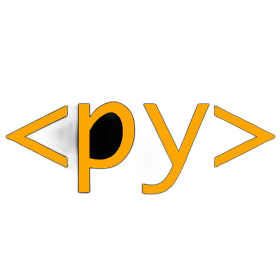

# CURSO DE PYSCRIPT
👨‍⚖️O PYSCRIPT É UMA BIBLIOTECA PYTHON QUE PERMITE A EXECUÇÃO DE SCRIPTS EM PYTHON DIRETAMENTE NO NAVEGADOR DA WEB. ELE É ÚTIL PARA CRIAR APLICAÇÕES WEB INTERATIVAS E DINÂMICAS, PERMITINDO AOS DESENVOLVEDORES USAR PYTHON NO LADO DO CLIENTE. 

  

## CONCEITO:
O PyScript é uma biblioteca Python que possibilita a execução de scripts em Python diretamente no navegador da web. Ele permite aos desenvolvedores criar aplicações web interativas e dinâmicas usando a linguagem de programação Python no lado do cliente.

## SUA HISTÓRIA:
O projeto PyScript nasceu da necessidade de oferecer uma solução para desenvolvedores que desejam utilizar Python em aplicações web de forma mais integrada e dinâmica. Inspirado em outras tecnologias que permitem a execução de código Python no navegador, o PyScript foi desenvolvido com o objetivo de simplificar o processo de desenvolvimento web, aproveitando a familiaridade e a versatilidade da linguagem Python.

Desde o seu lançamento inicial, tem recebido contribuições da comunidade de desenvolvedores Python e tem evoluído para oferecer uma experiência cada vez melhor no desenvolvimento de aplicações web interativas e responsivas.

## CARACTERISTICAS:
### POSITIVAS:
- Facilita o desenvolvimento de aplicações web utilizando Python, uma linguagem popular e versátil.
- Distribuído como uma CDN, eliminando a necessidade de instalar o Python localmente e permitindo uma integração fácil em projetos web existentes.
- Oferece uma sintaxe simples e familiar para os desenvolvedores Python, tornando mais fácil a transição para o desenvolvimento web.
- Possibilita a criação de interfaces web interativas e dinâmicas com Python no lado do cliente, oferecendo um alto nível de flexibilidade e controle.

### NEGATIVAS:
- Como é uma tecnologia relativamente nova, pode ter uma curva de aprendizado para os desenvolvedores que não estão familiarizados com Python no lado do cliente.
- Pode ter limitações em termos de desempenho e recursos em comparação com outras tecnologias web mais estabelecidas.
- Ainda está em desenvolvimento ativo, então pode haver mudanças e atualizações frequentes que podem afetar a estabilidade e a compatibilidade do projeto.

## SUBSIDIOS:
- [CURSO CRIADO PELO "SCHOOL OF THOUGHT"](https://youtube.com/playlist?list=PLiaEveic8GhftJa6qTBJ_quU6-E36Xys1&si=3wvT3pXJ4o6PHZuR)
- [CURSO FEITO PELO VILHALVA](https://github.com/VILHALVA)
- [LINGUAGEM HTML E CSS](https://github.com/VILHALVA/CURSO-DE-HTML-E-CSS)
- [CURSO DE PYTHON](https://github.com/VILHALVA/CURSO-DE-PYTHON)
- [VEJA A DOCUMENTAÇÃO](https://pyscript.net/)
- [VEJA OS PROJETOS](https://github.com/VILHALVA?tab=repositories&q=topic:PYSCRIPT)

